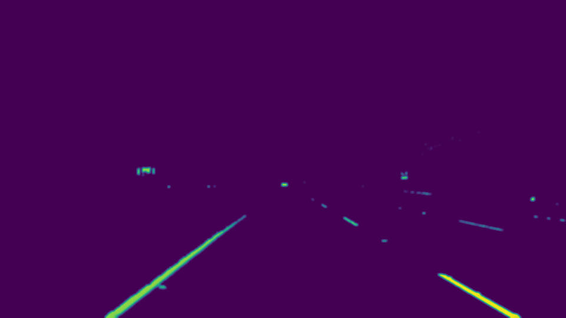
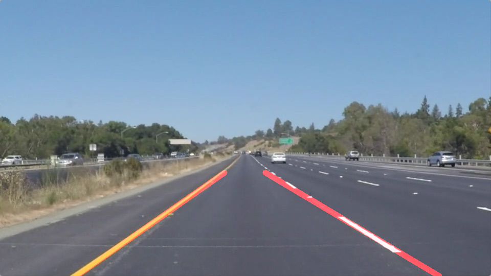

#**Finding Lane Lines on the Road** 

Overview
---

The goal of this project is to create a pipeline that finds lane lines on the road for self-driving cars.  It uses Python 3.5 and Opencv for building the pipeline.

Packages
------------
Following python packages are used:

 - OpenCV 
 - Matplotlib
 - Numpy
 - Math
 - Imageio
 - Moviepy

Setup
------------

 1. Install [CarND Term1 Starter Kit](https://classroom.udacity.com/nanodegrees/nd013/parts/fbf77062-5703-404e-b60c-95b78b2f3f9e/modules/83ec35ee-1e02-48a5-bdb7-d244bd47c2dc/lessons/8c82408b-a217-4d09-b81d-1bda4c6380ef/concepts/4f1870e0-3849-43e4-b670-12e6f2d4b7a7) Docker container
 2. Launch the Docker container
	 *docker run -it -p 8888:8888 -v {$pwd}:/notebooks udacity/carnd-term1-starter-kit*
 3. Open jupyter notebook from the url provided on the console

Reflection
----------

The pipeline consists of seven steps. 

First, I applied a color filter to only select the white and yellow pixels from the images (corresponding to the colors for the lane lines). This helped in removing spurious lines from the image and simplified the processing downstream.

Next, I converted the image to grayscale. Then smoothed using  Gaussian blur with a kernel of size 5 and sigma of 2. Canny edge detection was applied to the smoothed image resulting in removing most of the noise from the image as seen below: 

Next, region of interest was selected to only process subset of the image corresponding to road ahead. Hough transformation was used for line detection on the selected subset. And lines were drawn by extrapolating the points across multiple frames in the video stream. Lines with slope outside threshold were discarded. The detected lines were divided into left and right buckets and then a average slope and intercept was computed across 5 video frames for drawing actual lines. 

The pipeline was tested with the white and yellow lines and the challenge video. (*See outputs in test_videos_output folder*)

Shortcomings
----------
This pipeline works for simple lane detection for lanes that are straight, or have slight curves, and generally well marked highway roads . It also expects the recording camera to be placed in center of the car dashboard. 

Following shortcomings exist and can be explored in a future project:

 - Works for lane that have both left and right lane lines
 - Highway entry / exits with lane merging and city roads are not handled
 - Lanes with large gaps in line or poor line markings are not detected
 
 